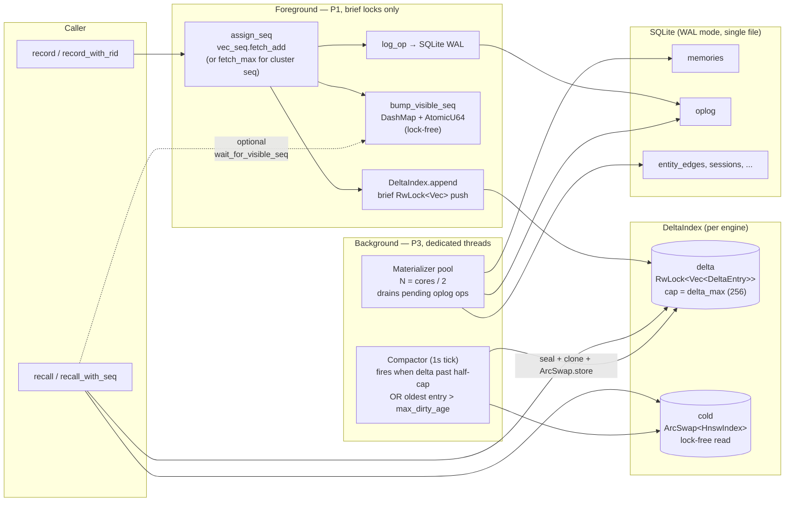
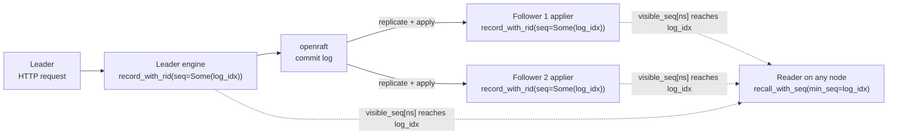

# YantrikDB — A Cognitive Memory Engine for Persistent AI Systems

> The memory engine for AI that actually knows you.

[](https://pypi.org/project/yantrikdb/)
[](https://crates.io/crates/yantrikdb)
[](LICENSE)

## Get Started in 60 Seconds

### For AI agents (MCP — works with Claude, Cursor, Windsurf, Copilot)

```bash
pip install yantrikdb-mcp
```

Add to your MCP client config:

```json
{
  "mcpServers": {
    "yantrikdb": {
      "command": "yantrikdb-mcp"
    }
  }
}
```

That's it. The agent auto-recalls context, auto-remembers decisions, and auto-detects contradictions — no prompting needed. See [yantrikdb-mcp](https://github.com/yantrikos/yantrikdb-mcp) for full docs.

### As a Python library

```bash
pip install yantrikdb
```

`record_text()` / `recall_text()` work out of the box — **no
`sentence-transformers` install, no ONNX runtime.** Just one
`pip install`.

A new file-backed store opens on `potion-base-8M` (256-dim), fetched
once (~28 MB, SHA-256 pinned, cached under your user cache dir) and
self-hosted from `yantrikos/yantrikdb-models` — no HuggingFace
dependency. If it cannot be fetched (offline), the store is created on
the bundled `potion-base-2M` (64-dim, ~7 MB, no download ever) and a
warning is logged. **An existing database always reopens at the
dimension it already holds**, so upgrading the library never strands
your data.

```python
import yantrikdb

# New store: potion-base-8M @ 256 dims (downloads once).
# Existing store: reopened at whatever dimension it already has.
db = yantrikdb.YantrikDB.with_default("memory.db")

db.record("Alice is the engineering lead", importance=0.8, domain="people")
db.record("Project deadline is March 30", importance=0.9, domain="work")
db.record("User prefers dark mode", importance=0.6, domain="preference")

results = db.recall("who leads the team?", top_k=3)
# → [{"text": "Alice is the engineering lead", "score": 1.0}, ...]

db.relate("Alice", "Engineering", "leads")
db.get_edges("Alice")

db.think()  # consolidate, detect conflicts, mine patterns

db.close()
```

#### Why the default is the 256-dim model

The embedder choice is measured on real agent memory, not a leaderboard.
Public benchmarks rank on Wikipedia-shaped text; agent memory is dense
operational notes with heavy internal vocabulary and near-duplicate
records that supersede one another, and it ranks the models differently.

Measured on **5,035 real production memories** with 12 questions whose
correct record was pinned by id, retrieved through the engine's own
`recall()` (not raw cosine — the engine's hybrid lexical lanes and
composite scoring are part of what you actually get):

| Embedder | Dim | MRR | Correct record absent from the top 100 |
|---|---|---|---|
| `potion-base-2M` (bundled fallback) | 64 | 0.120 | **4 of 12** |
| `potion-base-8M` (default) | 256 | **0.312** | **1 of 12** |

The miss rate is the reason, not the MRR. Under the smaller model a
third of real questions had no correct answer *anywhere* in the first
hundred results — which to a user is indistinguishable from the memory
not being there at all.

Two honest caveats. Twelve probes is a small set, enough to separate
0.120 from 0.312 but not to rank models a few points apart. And the gain
is **corpus-specific**: on conversational-paraphrase benchmarks the two
models are indistinguishable at every `k` from 2 to 80. Expect the
benefit on dense, vocabulary-heavy stores; do not assume it transfers.

#### Other embedder options

```python
# Larger still — 512-dim, ~121 MB, downloads on first call.
db = yantrikdb.YantrikDB("memory.db", embedding_dim=512)
db.set_embedder_named("potion-base-32M")

# Bring your own (sentence-transformers, fastembed, custom object).
from sentence_transformers import SentenceTransformer
db = yantrikdb.YantrikDB("memory.db", embedding_dim=384)
db.set_embedder(SentenceTransformer("all-MiniLM-L6-v2"))

# Force the bundled model — no download, works fully offline.
db = yantrikdb.YantrikDB("memory.db", embedding_dim=64)
```

| Path | Dim | Size on disk | Install network |
|---|---|---|---|
| `with_default` on a new store | 256 | ~28 MB (cached) | first run only |
| Bundled fallback (`embedding_dim=64`) | 64 | ~7 MB (bundled) | none, ever |
| `set_embedder_named("potion-base-32M")` | 512 | ~121 MB (cached) | first call only |
| `set_embedder(MiniLM)` | 384 | ~80 MB | sentence-transformers' own download |

**A store's dimension is fixed when it is created.** Switching models
later means re-embedding — `db.reembed("potion-base-8M")` does it in
place, preserving graph edges, consolidation state and conflict
metadata.

### As a Rust crate

```toml
[dependencies]
yantrikdb = "0.7"

# NOTE: the crate defaults differ from the pip package on purpose.
# `embedder-download` is OFF here, so a default cargo build has NO
# network code path at all and `with_default()` uses the bundled
# 64-dim potion-base-2M. The Python wheel enables it, so pip users get
# the 256-dim potion-base-8M default described above.
#
# To get that default (and set_embedder_named) in Rust, opt in:
# yantrikdb = { version = "0.7", features = ["embedder-download"] }
#
# Why not on by default: it pulls ureq + sha2 + dirs + tar + flate2
# into every build of an embedded database. See the measured retrieval
# difference above and decide for your deployment.

# Slim build (no bundled embedder, no network code path):
# yantrikdb = { version = "0.7", default-features = false }
```

## The Problem

Current AI memory is:

> Store everything → Embed → Retrieve top-k → Inject into context → Hope it helps.

That's not memory. That's a search engine with extra steps.

Real memory is hierarchical, compressed, contextual, self-updating, emotionally weighted, time-aware, and predictive. YantrikDB is built for that.

## Why Not Existing Solutions?

| Solution | What it does | What it lacks |
|----------|-------------|---------------|
| **Vector DBs** (Pinecone, Weaviate) | Nearest-neighbor lookup | No decay, no causality, no self-organization |
| **Knowledge Graphs** (Neo4j) | Structured relations | Poor for fuzzy memory, not adaptive |
| **Memory Frameworks** (LangChain, Mem0) | Retrieval wrappers | Not a memory architecture — just middleware |
| **File-based** (CLAUDE.md, memory files) | Dump everything into context | O(n) token cost, no relevance filtering |

### Benchmark: Selective Recall vs. File-Based Memory

| Memories | File-Based | YantrikDB | Token Savings | Precision |
|----------|-----------|-----------|---------------|-----------|
| 100 | 1,770 tokens | 69 tokens | **96%** | 66% |
| 500 | 9,807 tokens | 72 tokens | **99.3%** | 77% |
| 1,000 | 19,988 tokens | 72 tokens | **99.6%** | 84% |
| 5,000 | 101,739 tokens | 53 tokens | **99.9%** | 88% |

At 500 memories, file-based exceeds 32K context windows. At 5,000, it doesn't fit in any context window — not even 200K. YantrikDB stays at ~70 tokens per query. Precision *improves* with more data — the opposite of context stuffing.

### Evidence (reproducible)

Every claim here points at a runnable harness — not a static number. Each is
gated in CI ([`.github/workflows/benchmark.yml`](.github/workflows/benchmark.yml)) so a regression fails the build.

- **Recall doesn't degrade as the corpus grows, and stays fast.**
  [`python -m yantrikdb.eval.benchmark`](src/yantrikdb/eval/benchmark.py) holds a fixed
  signal corpus while adding distractors and measures recall + latency at each scale.
  Sample run: recall@k `0.938 → 0.929` as memories grow 7×, with p95 recall latency
  under 3 ms. `regression_check()` is the CI gate.
- **The knowledge graph earns its keep on connected data.**
  [`python -m yantrikdb.eval.graph_lift`](src/yantrikdb/eval/graph_lift.py) measures recall
  with entity-expansion ON vs OFF. Verdict on the connected corpus: **+2.5% recall, +1.7% MRR**
  — graph expansion helps where memories are actually linked.
- **Apples-to-apples vs other memory systems.**
  [`python -m yantrikdb.eval.competitors`](src/yantrikdb/eval/competitors.py) scores YantrikDB,
  mem0, Zep, and Letta on the same corpus, same queries, same metrics, no per-system
  tuning. (Competitors run once their libraries are installed; results are not
  pre-tuned.)

These run dependency-free on the bundled embedder, so anyone can reproduce them with
one command.

## Architecture

### Design Principles

- **Embedded, not client-server** — single file, no server process (like SQLite)
- **Local-first, sync-native** — works offline, syncs when connected
- **Cognitive operations, not SQL** — `record()`, `recall()`, `relate()`, not `SELECT`
- **Living system, not passive store** — does work between conversations
- **Thread-safe** — `Send + Sync` with internal Mutex/RwLock, safe for concurrent access

### Five Indexes, One Engine

```
┌──────────────────────────────────────────────────────┐
│                   YantrikDB Engine                    │
│                                                      │
│  ┌──────────┬──────────┬──────────┬──────────┐       │
│  │  Vector  │  Graph   │ Temporal │  Decay   │       │
│  │  (HNSW)  │(Entities)│ (Events) │  (Heap)  │       │
│  └──────────┴──────────┴──────────┴──────────┘       │
│  ┌──────────┐                                        │
│  │ Key-Value│  WAL + Replication Log (CRDT)          │
│  └──────────┘                                        │
└──────────────────────────────────────────────────────┘
```

1. **Vector Index (HNSW)** — semantic similarity search across memories
2. **Graph Index** — entity relationships, profile aggregation, bridge detection
3. **Temporal Index** — time-aware queries ("what happened Tuesday", "upcoming deadlines")
4. **Decay Heap** — importance scores that degrade over time, like human memory
5. **Key-Value Store** — fast facts, session state, scoring weights

### Decoupled Write Path (v0.6.6+)

The vector index is structured as a **two-tier LSM**: a small mutable
delta and an immutable HNSW cold tier swapped atomically via
`ArcSwap`. Foreground writes only touch the delta (brief lock,
O(1) push); HNSW work amortizes on a dedicated compactor thread.
This is what eliminated the production wedge where sustained writes
starved readers — see [CONCURRENCY.md](CONCURRENCY.md) and
[docs/decoupled_write_path_rfc.md](docs/decoupled_write_path_rfc.md).



**The structural invariant.** Foreground (P1) and background (P3) do
not share a lock primitive that holds for non-O(1) work. The cold
tier is read lock-free via `ArcSwap`; the delta's `RwLock` is held
for the O(1) push only. This is what makes "no single background
task can wedge reads, writes, or recovery" enforceable — see
[CONCURRENCY.md](CONCURRENCY.md) Rules 2 and 3 for the names and
failure modes if violated.

### Cluster Mode (RFC 010 + Phase 6 RYW)

For multi-node deployments, [yantrikdb-server](https://github.com/yantrikos/yantrikdb-server)
wraps the engine with [openraft](https://github.com/datafuselabs/openraft)
for leader-elected replication. The four cluster-mutation primitives
take the openraft commit-log index as their `seq`, so all nodes
agree on a single global monotonic sequence — read-your-writes works
across the cluster, not just within a node.



Each `record_with_rid` / `tombstone_with_rid` /
`upsert_entity_edge_with_id` / `delete_entity_edge_with_id` accepts
an optional `seq: Option<u64>`. Single-node callers pass `None` and
the engine allocates; cluster appliers pass `Some(commit_log_index)`
and the engine ratchets `vec_seq` up to at least that value via
`fetch_max`. After apply, `visible_seq[namespace]` reaches the
log index, so any subsequent `recall_with_seq(min_seq=N)` blocks
just long enough for the local node to have applied through index
N — and no longer.

### Memory Types (Tulving's Taxonomy)

| Type | What it stores | Example |
|------|---------------|---------|
| **Semantic** | Facts, knowledge | "User is a software engineer at Meta" |
| **Episodic** | Events with context | "Had a rough day at work on Feb 20" |
| **Procedural** | Strategies, what worked | "Deploy with blue-green, not rolling update" |

All memories carry **importance**, **valence** (emotional tone), **domain**, **source**, **certainty**, and **timestamps** — used in a multi-signal scoring function that goes far beyond cosine similarity.

## Key Capabilities

### Relevance-Conditioned Scoring

Not just vector similarity. Every recall combines:

- **Semantic similarity** (HNSW) — what's topically related
- **Temporal decay** — recent memories score higher
- **Importance weighting** — critical decisions beat trivia
- **Graph proximity** — entity relationships boost connected memories
- **Retrieval feedback** — learns from past recall quality

Weights are tuned automatically from usage patterns.

### Conflict Detection & Resolution

When memories contradict, YantrikDB doesn't guess — it creates a conflict segment:

```
"works at Google" (recorded Jan 15) vs. "works at Meta" (recorded Mar 1)
→ Conflict: identity_fact, priority: high, strategy: ask_user
```

Resolution is conversational: the AI asks naturally, not programmatically.

### Semantic Consolidation

After many conversations, memories pile up. `think()` runs:

1. **Consolidation** — merge similar memories, extract patterns
2. **Conflict scan** — find contradictions across the knowledge base
3. **Pattern mining** — cross-domain discovery ("work stress correlates with health entries")
4. **Trigger evaluation** — proactive insights worth surfacing

### Proactive Triggers

The engine generates triggers when it detects something worth reaching out about:

- Memory conflicts needing resolution
- Approaching deadlines (temporal awareness)
- Patterns detected across domains
- High-importance memories about to decay
- Goal tracking ("how's the marathon training?")

Every trigger is grounded in real memory data — not engagement farming.

### Multi-Device Sync (CRDT)

Local-first with append-only replication log:

- **CRDT merging** — graph edges, memories, and metadata merge without conflicts
- **Vector indexes rebuild locally** — raw memories sync, each device rebuilds HNSW
- **Forget propagation** — tombstones ensure forgotten memories stay forgotten
- **Conflict detection** — contradictions across devices are flagged for resolution

### Sessions & Temporal Awareness

```python
sid = db.session_start("default", "claude-code")
db.record("decided to use PostgreSQL")  # auto-linked to session
db.record("Alice suggested Redis for caching")
db.session_end(sid)
# → computes: memory_count, avg_valence, topics, duration

db.stale(days=14)    # high-importance memories not accessed recently
db.upcoming(days=7)  # memories with approaching deadlines
```

**Importing history.** `created_at` (epoch seconds) records an event at the
time it *happened* rather than the time it was loaded — so a bulk import
keeps its real timeline and every temporal surface stays meaningful:

```python
db.record("joined the observatory team", created_at=1_600_000_000.0)
db.record_batch([{"text": "...", "created_at": ts} for ts in anchors])

db.recall_as_of(march, query="where do they work")  # what was true then
```

Without it, every imported record shares the ingest wall-clock: decay and
recency become insertion-order noise, and `recall_as_of` / `time_window`
filter on a timeline that never existed. Omit it and the engine stamps
`now()`, exactly as before.

## Full API

| Operation | Methods |
|-----------|---------|
| **Core** | `record`, `record_batch`, `recall`, `recall_with_response`, `recall_refine`, `forget`, `correct` |
| **Knowledge Graph** | `relate`, `get_edges`, `search_entities`, `entity_profile`, `relationship_depth`, `link_memory_entity` |
| **Cognition** | `think`, `get_patterns`, `scan_conflicts`, `resolve_conflict`, `derive_personality` |
| **Triggers** | `get_pending_triggers`, `acknowledge_trigger`, `deliver_trigger`, `act_on_trigger`, `dismiss_trigger` |
| **Sessions** | `session_start`, `session_end`, `session_history`, `active_session`, `session_abandon_stale` |
| **Temporal** | `stale`, `upcoming` |
| **Procedural** | `record_procedural`, `surface_procedural`, `reinforce_procedural` |
| **Lifecycle** | `archive`, `hydrate`, `decay`, `evict`, `list_memories`, `stats` |
| **Sync** | `extract_ops_since`, `apply_ops`, `get_peer_watermark`, `set_peer_watermark` |
| **Maintenance** | `rebuild_vec_index`, `rebuild_graph_index`, `learned_weights` |

## Technical Decisions

| Decision | Choice | Rationale |
|----------|--------|-----------|
| **Core language** | Rust | Memory safety, no GC, ideal for embedded engines |
| **Architecture** | Embedded (like SQLite) | No server overhead, sub-ms reads, single-tenant |
| **Bindings** | Python (PyO3), TypeScript | Agent/AI layer integration |
| **Storage** | Single file per user | Portable, backupable, no infrastructure |
| **Sync** | CRDTs + append-only log | Conflict-free for most operations, deterministic |
| **Thread safety** | Mutex/RwLock, Send+Sync | Safe concurrent access from multiple threads |
| **Query interface** | Cognitive operations API | Not SQL — designed for how agents think |

## Ecosystem

| Package | What | Install |
|---------|------|---------|
| [yantrikdb](https://crates.io/crates/yantrikdb) | Rust engine | `cargo add yantrikdb` |
| [yantrikdb](https://pypi.org/project/yantrikdb/) | Python bindings (PyO3) | `pip install yantrikdb` |
| [yantrikdb-mcp](https://pypi.org/project/yantrikdb-mcp/) | MCP server for AI agents | `pip install yantrikdb-mcp` |

## Roadmap

- [x] **V0** — Embedded engine, core memory model (record, recall, relate, consolidate, decay)
- [x] **V1** — Replication log, CRDT-based sync between devices
- [x] **V2** — Conflict resolution with human-in-the-loop
- [x] **V3** — Proactive cognition loop, pattern detection, trigger system
- [x] **V4** — Sessions, temporal awareness, cross-domain pattern mining, entity profiles
- [ ] **V5** — Multi-agent shared memory, federated learning across users

## Worked example: Wirecard (RFC 008 substrate — with honest limits)

For nearly a decade, Wirecard's filings and EY's audit attested to €1.9B in Philippine escrow accounts. In June 2020 both banks and the central bank formally denied the accounts existed.

When the `source_lineage` fields are hand-populated — EY as `[wirecard, ey]` to capture audit dependence on Wirecard-provided documents, BSP as `[bsp, bpi, bdo]` to capture restatement of the commercial banks — RFC 008's `⊕` discounts the dependent claims, and the contest operator's temporal split distinguishes present-tense contradictions from historical state changes. On this hand-populated data, the substrate produces useful annotations.

**Honest limits** (surfaced by Phase 2 empirical testing, Apr 2026):

- On naturalistic evidence where a real agent populates the fields, the substrate's gates don't reliably fire. Cases B and C of the Phase 2 eval need an extractor/canonicalizer (not yet built) to work; Case A exposed that `⊕` is mathematically incapable of flipping decisions at realistic N, regardless of coefficient tuning.
- **Current claim**: structured schema for evidence provenance/temporal/conflict annotation, useful for audit and inspection. The dependence-discount operator works on curated inputs but needs replacement before it can drive decisions.
- **Not a current claim**: "decision-improvement substrate for AGI-capable agents." That framing is withdrawn pending RFC 009.

See **[docs/showcase/wirecard.md](docs/showcase/wirecard.md)** for the full walkthrough including the Phase 2 negative result and the gold-state ablation that partitioned operator failure from extraction failure. Run the hand-populated demonstration directly:

```bash
cargo run --example showcase_wirecard
```

## Research & Publications

### 📄 Skill as Memory, Not Document (May 2026)

[Sarkar, P. (2026). *Skill as Memory, Not Document: A Database-Native Substrate for Agent Skill Catalogs*. Zenodo.](https://doi.org/10.5281/zenodo.20128887)

A measurement paper at 5K-skill scale: token cost vs filesystem catalogs (with the honest 1.49× ablation), retrieval latency (87.3 ms p50), and invalid-skill admission (0% YantrikDB vs 97% document-only baseline). Reproducible scripts + raw CSVs at [yantrikdb-server/benchmarks/skill_recall/](https://github.com/yantrikos/yantrikdb-server/tree/main/benchmarks/skill_recall). Companion blog: [yantrikdb.com/papers/skill-substrate](https://yantrikdb.com/papers/skill-substrate/).

### Earlier work

- **U.S. Patent Application 19/573,392** (March 2026): "Cognitive Memory Database System with Relevance-Conditioned Scoring and Autonomous Knowledge Management"
- **Zenodo (software):** [YantrikDB: A Cognitive Memory Engine for Persistent AI Systems](https://doi.org/10.5281/zenodo.18793952)

## Author

**Pranab Sarkar** — [ORCID](https://orcid.org/0009-0009-8683-1481) · [LinkedIn](https://www.linkedin.com/in/pranab-sarkar-b0511160/) · developer@pranab.co.in

## License

Apache-2.0. See [LICENSE](LICENSE) for the full text.

The [MCP server](https://github.com/yantrikos/yantrikdb-mcp) is MIT-licensed.
